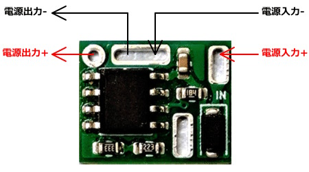

# 10V Blocker

 10V以上の電圧が入力されると、電源供給を遮断するモジュールです。

### 配線方法

- IN → 電源入力 +
- 上側中央のパッド → 電源入出力 -（グラウンド）
- OUT → 電源出力 +

基板下側のパッドはどこにも接続されていません。マル信無線電機 DCジャック MJ-40Aに直付けする場合、電池の接続が可能です。

### 注意事項

- 新品の電池は電圧が10V以上の場合があり、本モジュールにより電源が遮断される可能性があります。
- 電源の遮断が不十分となる場合があるため、消費電流0.1mA未満の機器には使用しないでください。

### 資料

- [10V Blocker 製作に関する記事](https://kanengomibako.github.io/pages/00379_10VBlocker.html)

| 主な仕様     |                                     |
| ------------ | ----------------------------------- |
| 最大入力電圧 | 30V                                 |
| 遮断電圧     | 10.0V ～ 10.3V                      |
| 直列抵抗     | 0.04Ω                               |
| 消費電流     | 0.7mA                               |
| 最大出力電流 | 1A                                  |
| 必要出力電流 | 0.1mA以上                           |
| 外形寸法     | 幅 12 mm × 奥行 10 mm × 高さ 2.5 mm |
| 質量         | 約 0.4 g                            |
