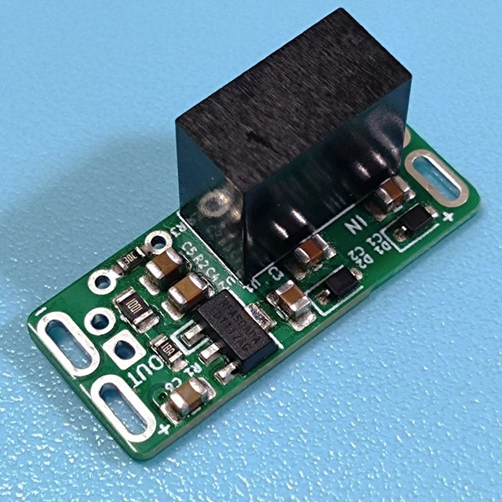

## 9V Isolator

 

9V電源入力から、アイソレートされた9V電源を出力するモジュールです。グラウンドの分離や負電源生成に使用できます。リニアレギュレータを搭載し、ノイズを低減しています。

### 配線方法

- IN+ → 電源入力 +
- IN- → 電源入力 -（グラウンド）
- OUT+ → 電源出力 +
- OUT- → 電源出力 -

負電源として使用する場合、OUT+ をグラウンド（アース）に、OUT- を負電源に接続してください。

### 注意事項

- 出力電流は、70mAを超えて使用しないでください。
- 入力側の電源は、充分余裕のある電流出力が可能なものを接続してください。
- 発熱があるため、熱傷にご注意ください。

出力電流に対する入力側の電流、本体の最高温度は以下の通りです（気温25℃付近で測定）。

| 出力側電流 | 入力側電流 | 温度 |
| ---------- | ---------- | ---- |
| 0 mA       | 17 mA      | 40℃  |
| 10 mA      | 33 mA      | 42℃  |
| 20 mA      | 46 mA      | 44℃  |
| 30 mA      | 60 mA      | 46℃  |
| 40 mA      | 74 mA      | 48℃  |
| 50 mA      | 88 mA      | 51℃  |
| 60 mA      | 102 mA     | 53℃  |
| 70 mA      | 118 mA     | 56℃  |

### 資料
- [9V Isolator 製作に関する記事](https://kanengomibako.github.io/pages/00374_9Visolator.html)

| 主な仕様 |  |
| - | - |
| 入力電圧 | 8.5V ～ 10V |
| 出力電圧 | 9.2V ～ 9.3V |
| 最大出力電流 | 70mA（入力側消費電流 118mA） |
| 外形寸法 | 幅 25.5 mm × 奥行 11.2 mm × 高さ 12.5 mm |
| 質量 | 約 2.3 g |
