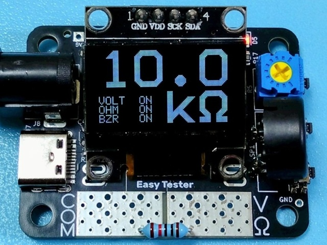
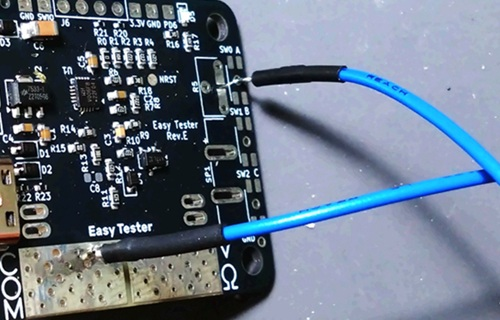
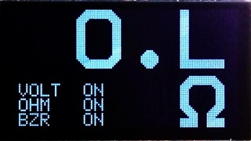
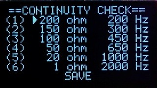
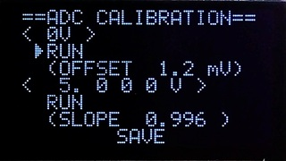
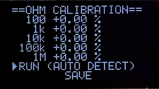

# Easy Tester

 簡易的な電圧計兼抵抗計です。作業机に常駐させておき、使いたいときにすぐ使えるというコンセプトとなっています。電源ボタンやオート電源オフ機能はありません。

### 使用方法

USB Type-Cコネクターに電源（4.5 ～ 20V）を接続します。電圧測定と抵抗測定は自動的に判別されます。

- 直流電圧測定

  COM端子を測定対象の電圧が低い側に、V・Ω端子を電圧が高い側に接続します。

  ※ 交流電圧、負電圧を測定することはできません。

- 抵抗測定

  COM端子とV・Ω端子をそれぞれ測定対象の両端に接続します。オートレンジです。

### 別売り外付け部品

- 表面実装用タクトスイッチ [THAU13-AB-R](https://akizukidenshi.com/catalog/g/g114889/)

  スイッチを取り付けない場合、下写真のようにCOM端子とスルーホール部分を接触させることでスイッチとして動作させることができます。

   

- 100kΩ半固定ボリューム（音量調整用、固定抵抗でも可）、圧電スピーカー（[PT33-130740HPR](https://akizukidenshi.com/catalog/g/g131072/)等）

  導通チェッカーとして動作させる場合、ブザー音を鳴らすために取り付けます。
  
- 基板取付用DCジャック（[MJ-179P](https://akizukidenshi.com/catalog/g/g109408/)等）

  USBコネクター以外から電源を供給する場合に取り付けます。

※ 長期使用に伴い、ディスプレイの表示が薄くなったり表示が焼き付いたりする可能性があります。交換品として、一般的な0.96インチ単色OLED（制御チップSSD1306）が使用可能です。

### 機能設定

導通チェックの抵抗値設定やキャリブレーションを行うことができます。右側のスイッチは、上からA、B、Cとしています。スイッチCを長押しすると設定モードが切り替わります。

※ 出荷時に1回、キャリブレーションを行ってあります。

- 通常モード

  通常の電圧・抵抗測定です。

   

  - A 短押し：電圧計オン／オフ
  - B 短押し：抵抗計オン／オフ
  - C 短押し：ブザー音オン／オフ
  - A 長押し：設定保存実行
  - C 長押し：モード切替

- 導通チェック設定モード

  ブザー音を鳴らす抵抗値の閾値と、その閾値を下回ったときに鳴らすブザー音の周波数を設定できます。複数の条件に当てはまった場合、順番は関係なく抵抗値が少ない方が優先されます。初期値は、全て100Ω、1000Hzに設定されています。

   

  - A 短押し：値を増加／実行
  - B 短押し：値を減少
  - C 短押し：カーソル移動
  - A 長押し：値を大きく増加
  - B 長押し：値を大きく減少
  - C 長押し：モード切替
  
- ADCキャリブレーションモード

  アナログ・デジタルコンバーター（ADC）の誤差を補正します。＜0V＞ではCOM端子とV・Ω端子をショートさせ、補正のオフセット値を算出します。もう一方では任意の電圧（1～20V）の基準電圧源を接続・設定し、補正の傾きを算出します。

   

  - A 短押し：値を増加／実行
  - B 短押し：値を減少
  - C 短押し：カーソル移動
  - C 長押し：モード切替
  
- 抵抗キャリブレーションモード

  抵抗測定の誤差を補正します。100Ω、1kΩ、10kΩ、100kΩ、1MΩのいずれかの基準抵抗を接続し、そのレンジの補正値を自動算出します。

   

  - A 短押し：実行
  - C 短押し：カーソル移動
  - C 長押し：モード切替

### 資料

- [Easy Tester 製作に関する記事](https://kanengomibako.github.io/)（準備中）

| 主な仕様 （メイン基板モジュール） |  |
| - | - |
| 測定可能電圧 | 0.2 ～ 20V（精度：1％ + 1 mV） |
| 測定可能抵抗値 | 0 ～ 2.2MΩ（精度：1％ + 1 Ω） |
| 電源電圧 | 4.5 ～ 20V |
| 消費電流 | 待機時 8 mA（最大20mA） |
| 外形寸法 | 幅 45 mm × 奥行 35 mm × 高さ 5 mm |
| 質量 | 約 6 g |
